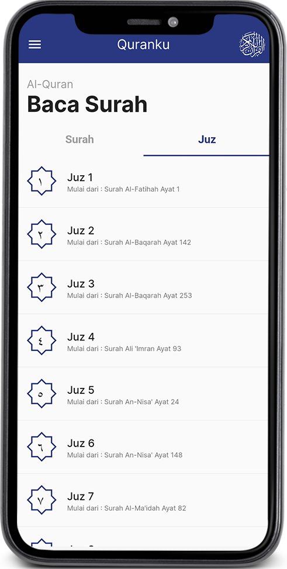
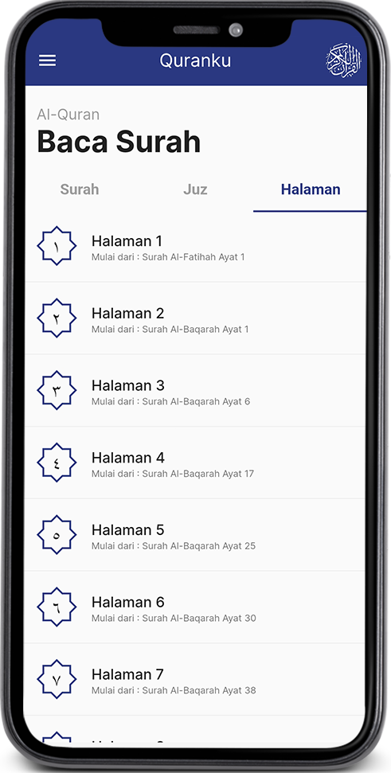
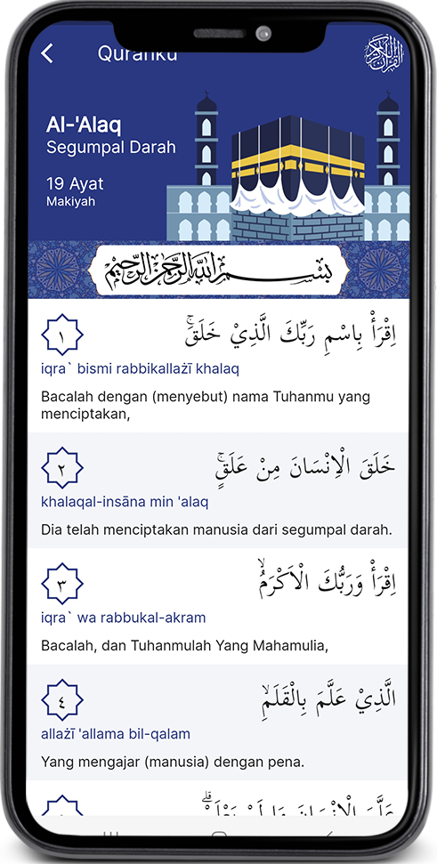
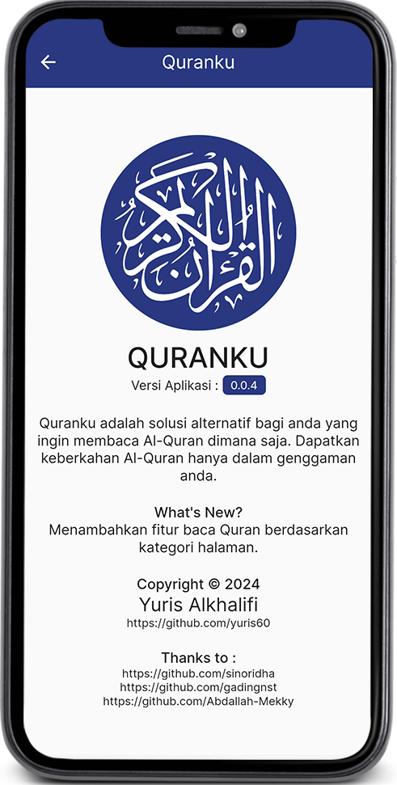

# Quranku
<div style="text-align:center"></div><br>

## Pengenalan

Quranku adalah solusi alternatif bagi anda yang ingin membaca Al-Quran dimana saja. Dapatkan keberkahan Al-Quran hanya dalam genggaman anda.

Quranku dibangun dengan menggunakan framework Flutter + SQLite berbasis Mobile Apps dan dapat diakses secara luring (offline).

## Screenshot
<table>
  <tr>
    <td>
      <h3 style="text-align: center">List Surah</h3>
      <div style="text-align:center"></div>
    </td>
  </tr>
  <tr>
    <td>
      <h3 style="text-align: center">List Juz</h3>
      <div style="text-align:center"></div>
    </td>
  </tr>
  <tr>
    <td>
      <h3 style="text-align: center">List Halaman</h3>
      <div style="text-align:center"></div>
    </td>
  </tr>
  <tr>
    <td>
      <h3 style="text-align: center">Baca Surah</h3>
      <div style="text-align:center"></div>
    </td>
  </tr>
  <tr>
    <td>
      <h3 style="text-align: center">About</h3>
      <div style="text-align:center"></div>
    </td>
  </tr>
</table>

## 📁 Download APK
Jika ingin menginstall langsung menggunakan APK dapat mengunjungi laman <a href="https://github.com/yuris60/quranku/tree/main/APK">berikut ini</a>.

## 💻 Developer

- Android Studio Giraffe `2022.03.1 Patch 1`
- VS Code `1.85.2`
- Flutter `3.13.2`
- Dart `3.1.0`
- JDK `19.0.0`
- Git `2.35.1`

Buka CMD pada folder yang akan menyimpan kloning project, lalu jalankan perintah berikut:

```
git clone https://github.com/yuris60/quranku.git
cd quranku
flutter packages get
flutter run
```

## Sumber Data

Data yang diambil pada Quranku sesuai dengan Kemenag yang diambil dari data-data yang tercantum pada daftar berikut ini. Ucapan terimakasih diucapkan kepada sumber-sumber berikut ini, karenanya aplikasi ini dapat diluncurkan. Semoga Allah memberikan pahala jariah baginya.

1. <a href="https://github.com/sinoridha/quran-indonesia-db" target="_blank">Sinoridha</a>
2. <a href="https://github.com/gadingnst/quran-api/blob/main/data/juz.json" target="_blank">Gadingnst</a>
3. <a href="https://github.com/Abdallah-Mekky/Quran-Database" target="_blank">Abdallah-Mekky</a>
