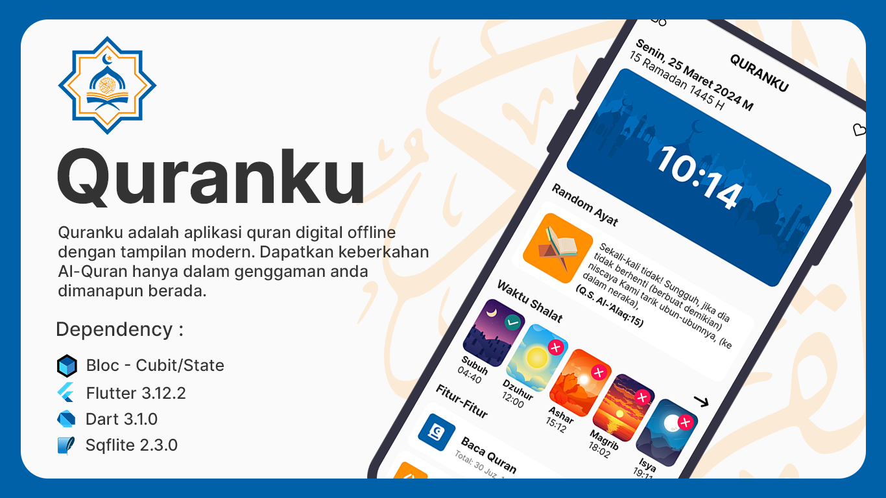
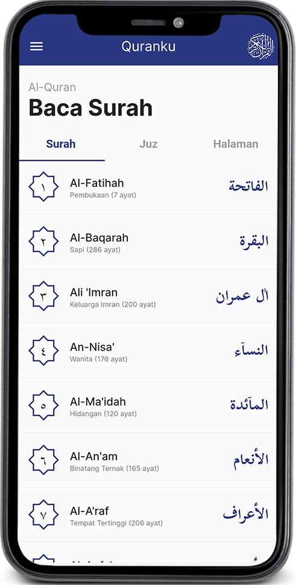
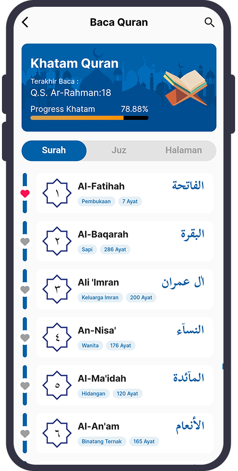
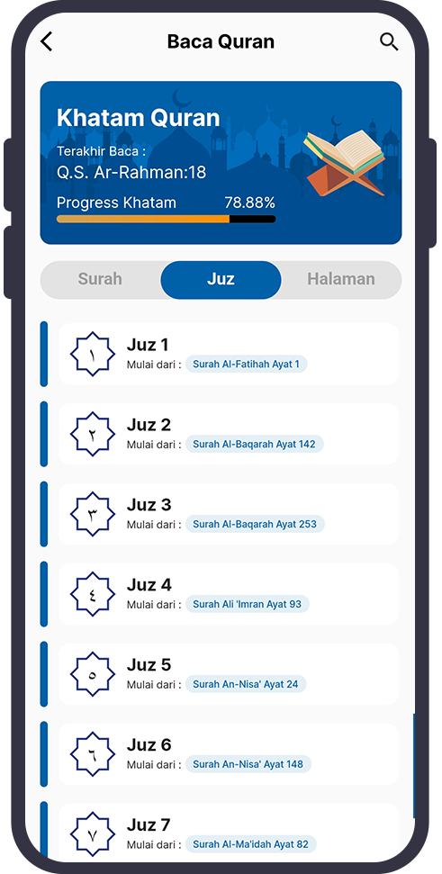
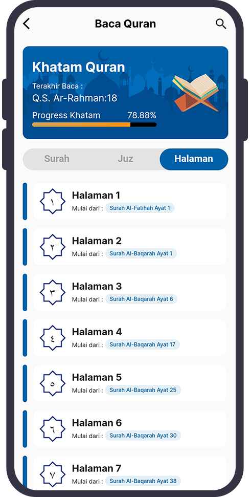

# Quranku
Quranku dibangun dengan menggunakan framework Flutter + SQLite berbasis Mobile Apps dan dapat diakses secara luring (offline).
<div align="center">
</div>

## 📌Fitur
- [x] Baca Al-Quran (Berdasarkan Surah, Juz & Halaman)
- [x] Doa Sehari-Hari
- [x] Jadwal Shalat**
- [x] Merekam Aktifitas Shalat
- [x] Bookmark Surah dan Doa

** Note : Saat ini hanya ada 2 lokasi  yang tersedia yakni Jakarta & Karawang.

## 📁 Download APK
Jika ingin menginstall langsung menggunakan APK dapat mengunjungi laman <a href="https://github.com/yuris60/quranku/tree/main/APK">berikut ini</a>.

## 💻 Developer

- Android Studio Giraffe `2022.03.1 Patch 1`
- VS Code `1.85.2`
- Flutter `3.13.2`
- Dart `3.1.0`
- JDK `19.0.0`
- Git `2.35.1`

Buka CMD pada folder yang akan menyimpan kloning project, lalu jalankan perintah berikut:

```
git clone https://github.com/yuris60/quranku.git
cd quranku
flutter pub get
flutter run
```

## 📱 Screenshot






## 📝 Sumber Data

Data pada Quranku sesuai dengan Kemenag yang diambil dari data-data yang tercantum pada daftar berikut ini. Ucapan terimakasih diucapkan kepada sumber-sumber berikut ini, karenanya aplikasi ini dapat diluncurkan. Semoga Allah memberikan pahala jariah baginya. Aamiin yaa Rabbal'alamin.

1. <a href="https://github.com/sinoridha/quran-indonesia-db" target="_blank">Sinoridha</a>
2. <a href="https://github.com/gadingnst/quran-api/blob/main/data/juz.json" target="_blank">Gadingnst</a>
3. <a href="https://github.com/Abdallah-Mekky/Quran-Database" target="_blank">Abdallah-Mekky</a>
4. <a href="https://doa-doa-api-ahmadramadhan.fly.dev/api" target="_blank">Ahmad Ramadhan</a>
4. <a href="https://bimasislam.kemenag.go.id/jadwalshalat" target="_blank">Bima Islam Kemenag</a>
