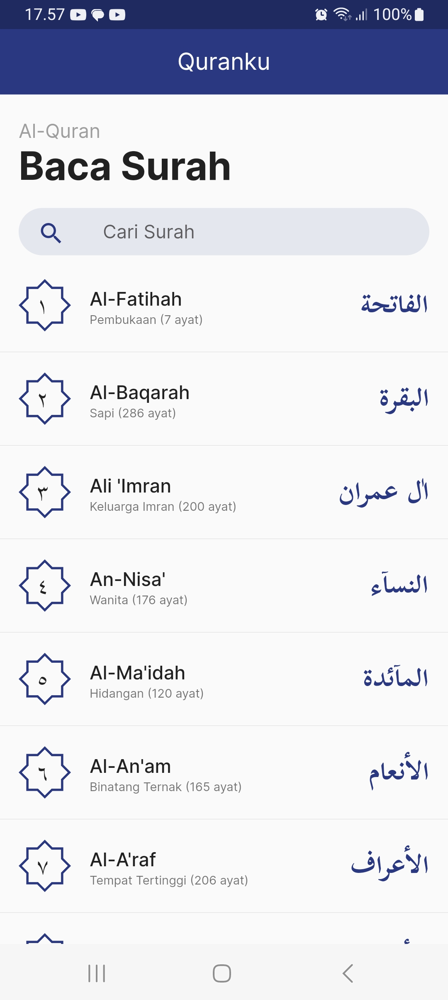
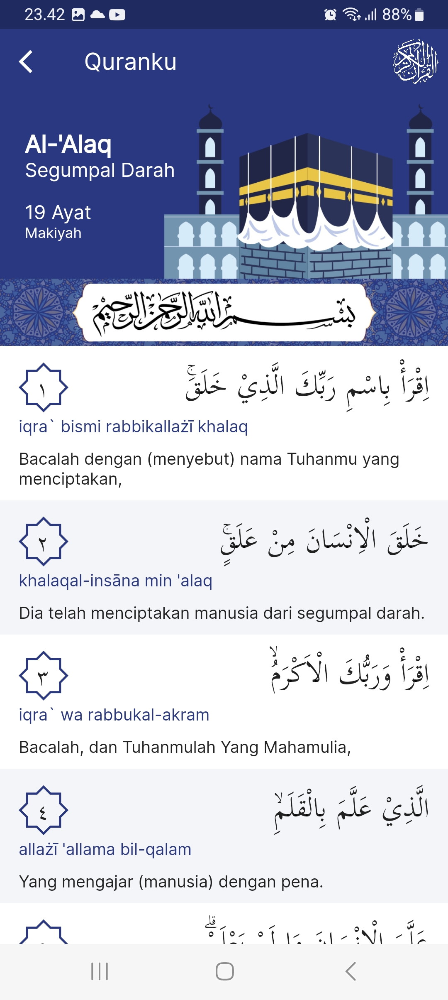

# Quranku
 

## Pengenalan

Aplikasi Al-Quran digital berbasis mobile, dapat diakses secara luring (offline). Dibangun dengan menggunakan framework Flutter + SQLite.

## Screenshot
<table>
  <tr>
    <td></td>
    <td></td>
  </tr>
</table>

## Download APK
Jika ingin menginstall langsung menggunakan APK dapat mengunjungi laman <a href="https://github.com/yuris60/quranku/tree/main/APK">berikut ini</a>.

## Sumber Data

Kami sangat berterimakasih kepada sumber-sumber data yang tercantum pada daftar berikut ini, karenanya aplikasi ini dapat diluncurkan.

1. <a href="https://github.com/sinoridha/quran-indonesia-db" target="_blank">quran-indonesia-db</a>
