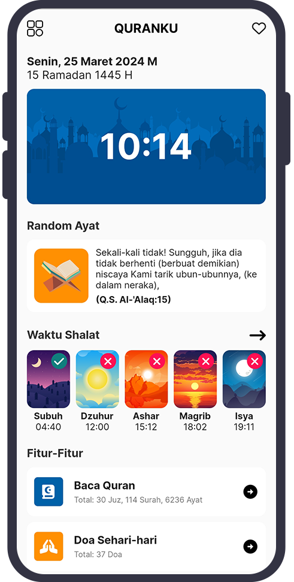

# Quranku

 

## Pengenalan

Quranku adalah solusi alternatif bagi anda yang ingin membaca Al-Quran dimana saja. Dapatkan keberkahan Al-Quran hanya dalam genggaman anda.

Quranku dibangun dengan menggunakan framework Flutter + SQLite berbasis Mobile Apps dan dapat diakses secara luring (offline).

## Screenshot
<table>
  <tr>
    <td>
      <h3 style="text-align: center">List Surah</h3>
      

    </td>
  </tr>
  <tr>
    <td>
      <h3 style="text-align: center">Baca Surah</h3>
      

    </td>
  </tr>
  <tr>
    <td>
      <h3 style="text-align: center">About</h3>
      

    </td>
  </tr>
</table>

## Download APK
Jika ingin menginstall langsung menggunakan APK dapat mengunjungi laman <a href="https://github.com/yuris60/quranku/tree/main/APK">berikut ini</a>.

## Sumber Data

Kami sangat berterimakasih kepada sumber-sumber data yang tercantum pada daftar berikut ini, karenanya aplikasi ini dapat diluncurkan.

1. <a href="https://github.com/sinoridha/quran-indonesia-db" target="_blank">quran-indonesia-db</a>
